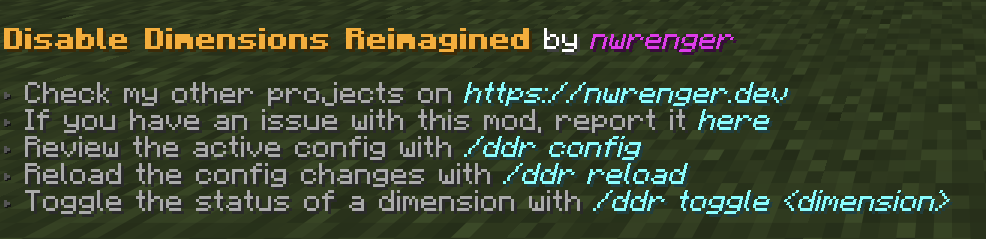
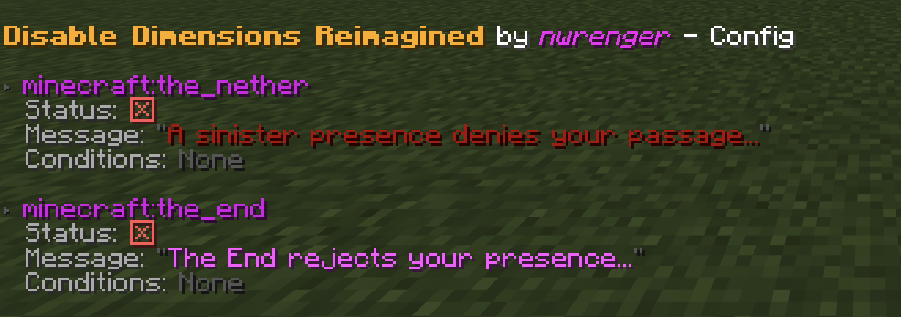

# Disable Dimensions Reimagined

[](https://modrinth.com/mod/disable-dimensions-reimagined)
[](https://modrinth.com/mod/disable-dimensions-reimagined)
[](https://modrinth.com/mod/disable-dimensions-reimagined)

A **native, seamless, grief-resistant solution** for preventing players from entering **The Nether**, **The End**, and any further **custom dimensions**, with optional per-dimension **conditions**.

Allows you to disable dimensions by intercepting the teleportation itself, so players seamlessly cannot enter. Each dimension can be separately `enabled` or `disabled`, with optional conditions which override that status.

It's the official successor to the **Disable Dimensions** data pack/mod utilizing the full capabilities of Minecraft modding.

> Perfect for modded multiplayer servers where you want to disable further dimensions to prevent players from progressing too fast.

[](https://www.youtube.com/watch?v=3bVRtYwfQ1I)

## Why use this mod?

1. **Native**:
   All logic is implemented directly in Java, with no tick-based checks. This results in a seamless experience for players, with no lag or stutter when they try to enter a disabled dimension.
2. **Comprehensive Coverage**:
   Works in every situation. For all players and entities (ender pearls), teleportation commands, and more. The teleportation is normally intercepted before it even happens, so players are never actually in the disabled dimension. See [Edge Cases](#edge-cases) for the handful of scenarios that require manual cleanup.
3. **Immersive Feedback**:
   On the teleport interception, players see a short action bar message, hear a subtle sound cue and get a slowness effect applied, making the experience clear and responsive.
4. **Compatible and Flexible**:
   Fully compatible with any modded and custom dimensions setups right out of the box. It also includes built-in language support.
5. **Server-Ready**:
   Built to be reliable, grief-resistant, and completely passive, with no extra overhead through tick-based checks. Perfect for public or semi-public multiplayer servers.
6. **Extensive Configuration**:
   Can be adjusted in real time through the reload and toggle commands, no restarts required. Via conditions, you can disable dimension for a specific time, for specific players, and so on. Look at the [Conditions](#conditions) section for more information.

> **TL;DR**: A stable and lightweight way to stop unwanted dimension travel, made to just work.

## How it works

When a dimension is disabled, the mod intercepts the teleportation event before it happens. The player or entity is never actually teleported to the disabled dimension, and players receive feedback that the dimension is blocked.

Determining if a dimension is disabled is done through the `disabled` flag in the config, as well as any optional conditions which can override that flag. The conditions are evaluated as the player/entity attempts to teleport.

To be grief-resistant and compatible, the mod also has a fallback mechanism which triggers after the player entered the dimension. Then, similar to the predecessor, it teleports the player back to the spawn point or entering location (only for The Nether).

## Installation

After adding the mod to your world or server, you should be able to open the about panel, which is fully controllable with the mouse:

```mcfunction
/ddr about
```

or

```mcfunction
/disabledimensionsreimagined about
```



### Language Support

Translated text is available for supported languages. This is mainly intended for server admins, since the configurable messages shown to players can be customized anyway. This gets packaged with the mod, so no extra downloads are required.

To add new translations, please refer to [this README](https://github.com/nwrenger/disable-dimensions-reimagined/tree/main/TRANSLATION.md).

## Configuration

A config file is created at:

```text
./config/disable-dimensions-reimagined.json
```

Default contents:

```json
{
  "dimensions": {
    "minecraft:the_nether": {
      "disabled": true,
      "message": {
        "text": "A sinister presence denies your passage...",
        "color": "dark_red"
      },
      "conditions": []
    },
    "minecraft:the_end": {
      "disabled": true,
      "message": {
        "text": "The End rejects your presence...",
        "color": "light_purple"
      },
      "conditions": []
    }
  }
}
```

> This makes The Nether and The End be disabled by default, with custom messages for each.

### Structure

- `dimensions`: Containing dimension identifiers as keys, and their configuration as values.

### Dimension

After adding the dimension identifier in the format of `namespace:id`, the following fields are available:

- `disabled`: Whether the dimension is disabled or not.
- `message`: The message shown to players when they attempt to enter the dimension.
- `conditions`: An array of conditions which can override the `disabled` flag.

Here is an example for two custom dimensions:

**The Aether**

```json
"aether:the_aether": {
  "disabled": true,
  "message": {
    "text": "A radiant force from the heavens bars your ascent...",
    "color": "aqua"
  },
  "conditions": []
}
```

**ATM10 - The Other**

```json
"allthemodium:the_other": {
  "disabled": true,
  "message": {
    "text": "A mysterious force from The Other prevents your entry...",
    "color": "dark_purple"
  },
  "conditions": []
}
```

### Message

The message consists of the following fields:

- `text`: The text shown to players when they attempt to enter the dimension.
- `color`: The color of the text shown to players when they attempt to enter the dimension. The color can be any valid Text Component color.

### Conditions

Conditions can overwrite the current set status if they're true. With them you can partially enable/disable dimension travel after a specific time, for a specific gamemode and so on.

Each condition requires:

- `type`: Determines what the value gets checked against.
  - `ADVANCEMENT`: Checks the player's advancements. The value is the advancement ID.
  - `DAY`: Checks the in-game day count. The value is the at least required day count.
  - `GAMEMODE`: Checks the player's current gamemode. The value can be `survival`, `creative`, `adventure`, or `spectator`.
  - `GAMETIME`: Checks how long the world has been running. The value is given in seconds, so use a formula like `day_count * 24 * 60 * 60` for days. This time only advances while the world is running, so server downtime affects accuracy.
  - `ITEM`: Checks the items inside the player's inventory. The value is an item ID with an optional item component filter, for example `minecraft:diamond[count=64]`.
  - `PLAYTIME`: Checks the player's playtime. The value is given in seconds, so use a formula like `hours * 60 * 60` for hours. This time only advances while the player is online, so offline time does not count.
  - `SCORE`: Checks the player's scoreboard scores. The value uses the format `objective_name=score_value`, for example `nether_entries=5`.
  - `TAG`: Checks the player's tags. You can give players custom tags, like `enter_nether`.
  - `TEAM`: Checks the player's team. The value is the team name, for example `red_team`.
- `value`: The specific value to check against. Its format depends on the selected type.
- `disabled`: The disabled value which overwrites the current status if the condition applies.

> If you have multiple conditions, the ordering matters. These get evaluated in order from top to bottom, and the first condition which applies will overwrite the current status.

Here are three examples of conditions:

**Enable after three days**

```json
{
  "type": "DAY",
  "value": "3",
  "disabled": false
}
```

**Enable for creative mode**

```json
{
  "type": "GAMEMODE",
  "value": "creative",
  "disabled": false
}
```

**Disable after 7 in-game days**

```json
{
  "type": "DAY",
  "value": "7",
  "disabled": true
}
```

### Active Configuration

The active configuration can be reviewed in-game with:

```mcfunction
/ddr config
```

or

```mcfunction
/disabledimensionsreimagined config
```



> The screenshot shows the default config listed above.

### Reload

After editing the config file, apply changes without restarting by running:

```mcfunction
/ddr reload
```

or

```mcfunction
/disabledimensionsreimagined reload
```

> If the config is invalid, the command reports the error and keeps the previous valid config active.

### Toggle

Each configured dimension entry's base status can be toggled in-game with:

```mcfunction
/ddr toggle <dimension_id>
```

or

```mcfunction
/disabledimensionsreimagined toggle <dimension_id>
```

## Edge Cases

This mod is intentionally on the teleportation event, with a few rare transitions requiring manual cleanup or resulting in different from expected behavior:

1. **Respawn in disabled dimension**:
   If a respawn point via a respawn anchor or the `spawnpoint` command is set inside a dimension that later gets disabled, the player will continue to respawn there until the respawn point is cleared or reset.
2. **Already inside on disable**:
   Players who are already in The Nether, The End, or a custom dimension when it gets disabled will remain there until they change dimensions. Teleport them out if needed.

## Contributing & Issues

I warmly welcome:

- Bug reports
- Feature requests
- Pull requests

Please open issues or PRs on [GitHub](https://github.com/nwrenger/disable-dimensions-reimagined/issues).

## License

This project is licensed under the **LGPLv3 License**. See [LICENSE](https://github.com/nwrenger/disable-dimensions-reimagined/blob/main/LICENSE) for details.
